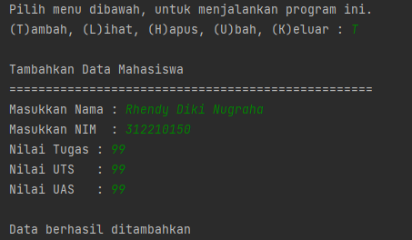
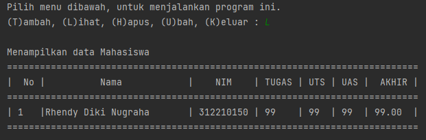
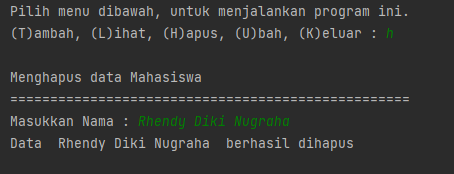
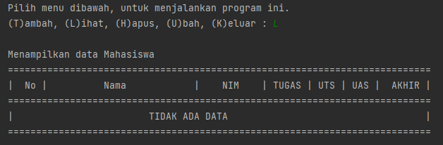
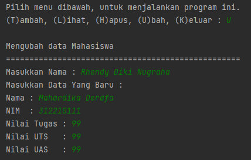
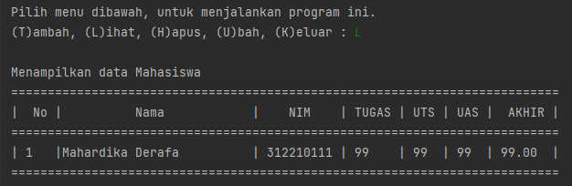
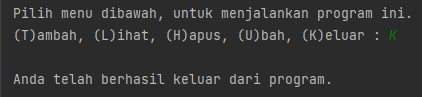
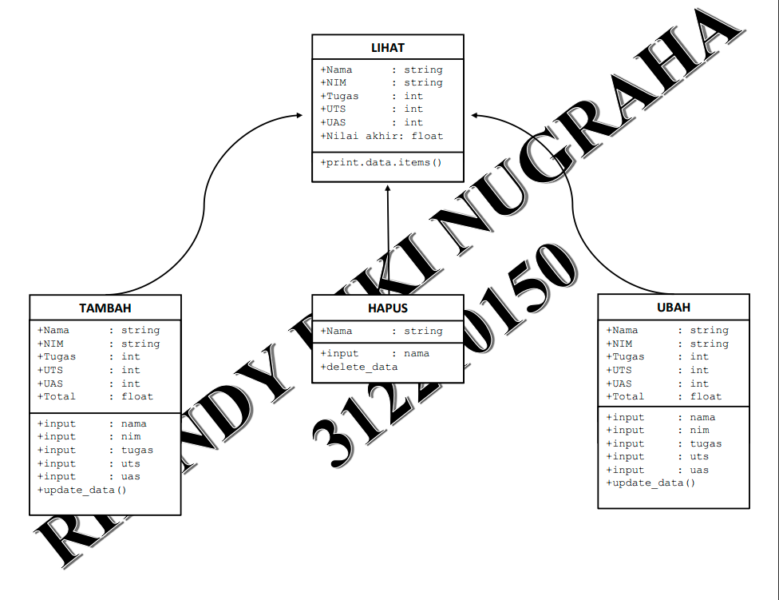
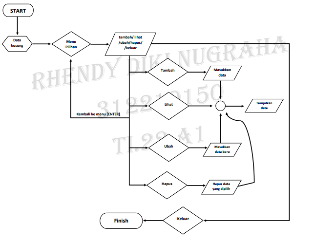

# Praktikum 8
| No.| DAFTAR ISI    | FILE          | GOTO                            |
|----|---------------|---------------|---------------------------------|
| 1. | Program       | Praktikum8.py | [Menuju Kesini](#program)       |
| 2. | Diagram Class | Diagram.png   | [Menuju Kesini](#diagram-class) |
| 3. | Flowchart     | Flowchart.png | [Menuju Kesini](#flowchart)     |
| 4. | Penutup       |               | [Menuju Kesini](#penutup)       |

Pada praktikum ke 8, isi dari praktikum ini masih sama seperti praktikum minggu kemarin. Disini, Saya masih akan membuat sebuah program untuk menampilkan data Mahasiswa. Bedanya, kali ini menggunakan OOP.

## Program
Perintah dari program ini, nantinya akan berisi :<br/>
• Method tambah() untuk menambah data<br/>
• Method tampilkan() untuk menampilkan data<br/>
• Method hapus(nama) untuk menghapus data berdasarkan nama<br/>
• Method ubah(nama) untuk mengubah data berdasarkan nama<br/>

Jika dibuat programnya maka akan menjadi seperti ini :
1. Pertama, kita membuat sebuah class mahasiswa. Didalam class ini, terdapat beberapa atribut yaitu : Nama, NIM, Nilai Tugas, Nilai UTS, dan Nilai UAS. Kita juga perlu def__init__ dan juga self, untuk mendeklarasikan class tersebut.
```
class mahasiswa():
    def __init__(self, nama, nim, tugas, uts, uas):
        self.nama = nama
        self.nim = nim
        self.tugas = tugas
        self.uts = uts
        self.uas = uas
```
2. Selanjutnya, tambahkan beberapa method untuk menambah, menampilkan, menghapus, mengubah, dan keluar.<br/>

***Menambah*** ( method ini berguna untuk menambahkan sebuah data. Data akan ditambahkan dengan cara append, agar nantinya data baru yang ditambahkan akan berada di bawah setelah data yang lama.)
```
    def tambah(self, nama, nim, tugas, uts, uas):
        data.nama.append(nama)
        data.nim.append(nim)
        data.tugas.append(tugas)
        data.uts.append(uts)
        data.uas.append(uas)
```
***Menampilkan*** ( lalu method melihat, method ini tujuannya untuk menampilkan semua data yang sudah ditambahkan diawal tadi, mulai dari Nama, NIM, dan nilai-nilai.)
```
 def lihat(self):
        for i in range(len(data.nama)):
            print("|", i + 1, "  |", end="")
            print('{0:<25}'.format(self.nama[i]), end=" ")
            print("|", self.nim[i], end="")
            print(" |", self.tugas[i], end="")
            print("    |", self.uts[i], end="")
            print("  |", self.uas[i], " | ", end="")
            print(f'{((self.tugas[i] * 30 / 100) + (self.uts[i] * 35 / 100) + (self.uas[i] * 35 / 100)) :.2f}', " |")
```
***Menghapus*** ( method menghapus, tentunya digunakan untuk menghapus data yang sudah ditambahkan. Untuk menghapusnya kita akan diminta untuk memasukan nama.)
```
    def hapus(self):
        del self.nama[no]
        del self.nim[no]
        del self.tugas[no]
        del self.uts[no]
        del self.uas[no]
```
***Mengubah*** ( dan yang terakhir method ubah, method yang akan mengubah data dari data yang sudah ditambahkan. Masih sama seperti method hapus, untuk mengubah datanya kita akan diminta menginput nama.)
```
    def ubah(self, nama, nim, tugas, uts, uas):
        self.nama[no] = nama
        self.nim[no] = nim
        self.tugas[no] = tugas
        self.uts[no] = uts
        self.uas[no] = uas
```
3. Tambahkan juga sebuah dictionary kosong, yang berguna untuk menyimpan semua data yang sudah kita masukkan diawal.<br/>
```
data = mahasiswa([],[],[],[],[])
```
4. Yang terakhir, membuat output perulangan. Perulangan ini, akan bergantung sesuai dari pilihan apa yang kita masukkan.
```
while True:
    print("\nPilih menu dibawah, untuk menjalankan program ini.")
    menu = input("(T)ambah, (L)ihat, (H)apus, (U)bah, (K)eluar : ")
    if menu == "t" or menu == "T":
        print("\nTambahkan Data Mahasiswa")
        print("==================================================")
        data.tambah(
            input("Masukkan Nama : "),
            input("Masukkan NIM  : "),
            int(input("Nilai Tugas : ")),
            int(input("Nilai UTS   : ")),
            int(input("Nilai UAS   : "))
        )
        print("\nData berhasil ditambahkan")

    elif menu == "l" or menu == "L":
        print("\nMenampilkan data Mahasiswa")
        print("===========================================================================")
        print("|  No |          Nama            |    NIM    | TUGAS | UTS | UAS |  AKHIR |")
        print("===========================================================================")
        if len(data.nama) != 0:
            data.lihat()
        else:
            print("|                        TIDAK ADA DATA                                   |")
        print("===========================================================================")

    elif menu == "h" or menu == "H":
        print("\nMenghapus data Mahasiswa")
        print("==================================================")
        hapus = input("Masukkan Nama : ")
        if hapus in data.nama:
            no = data.nama.index(hapus)
            data.hapus()
            print("Data ", hapus, " berhasil dihapus")
        else:
            print("Nama ", hapus, " tidak terdaftar")

    elif menu == "u" or menu == "U":
        print("\nMengubah data Mahasiswa")
        print("==================================================")
        ubah = input("Masukkan Nama : ")
        if ubah in data.nama:
            no = data.nama.index(ubah)
            print("Masukkan Data Yang Baru : ")
            data.ubah(
                input("Nama : "),
                input("NIM  : "),
                int(input("Nilai Tugas : ")),
                int(input("Nilai UTS   : ")),
                int(input("Nilai UAS   : "))
            )
        else:
            print("Nama ", ubah, " tidak terdaftar")

    elif menu == "k" or menu == "K":
        print("\nAnda telah berhasil keluar dari program.\n")
        break

    else:
        print("\nMenu pilihan yang dimasukkan tidak ada")
        print("Masukkan pilihan yang valid!")
```
## Hasil RUN
Beginilah hasil dari RUN program ini :<br/>
1. Tambah data<br/>

2. Menampilkan data<br/>

3. Menghapus data<br/>

***Jika memilih menampilkan data lagi, maka akan seperti ini:***<br/>

4. Mengubah data<br/>

***Nantinya data yang awal akan berubah:***<br/>

5. Keluar<br/>


## Diagram Class


## Flowchart
Karena program masih sama dengan kemarin, maka flowchart yang saya gunakan masih sama juga :


## Penutup
Seperti biasa, sudah sampai kita di akhir repository ini. Mohon maaf jika ada kesalahan kata maupun pengetikan. Akhir kata, saya ucapkan Terimakasih bagi yang sudah membaca...

```
Nama    : Rhendy Diki Nugraha
NIM     : 312210150
Kelas   : TI.22.A1
Dosen   : Agung Nugroho, S.kom, M.kom
```